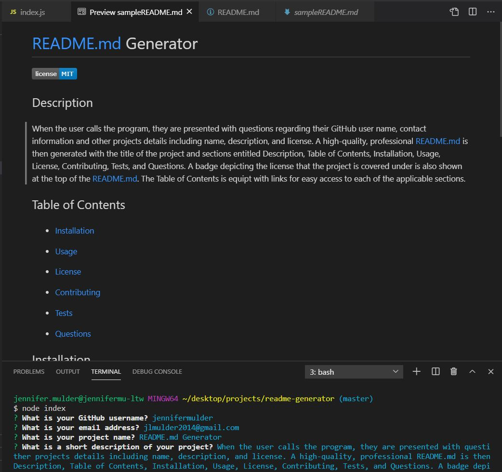

# **README Generator**

## Tutorial

https://drive.google.com/file/d/1yjV-ds8We-1xDf9jeIC43Jt16lWsn0hU/view

## **Purpose**
To provide the user with an efficient solution to producing a professional README by simply answering questions when prompted from the command line.

## **Features** 
When the user calls the program, they are presented with questions regarding their GitHub user name, contact information and other projects details including name, description, and license. A high-quality, professional README.md is then generated with the title of the project and sections entitled Description, Table of Contents, Installation, Usage, License, Contributing, Tests, and Questions. A badge depicting the license that the project is covered under is also shown at the top of the README.md. The Table of Contents is equipt with links for easy access to each of the applicable sections.

## Built With
* HTML
* JavaScript
* Node JS - (packages include file system and inquirer)

## Contribution
Created by Jennifer Mulder
